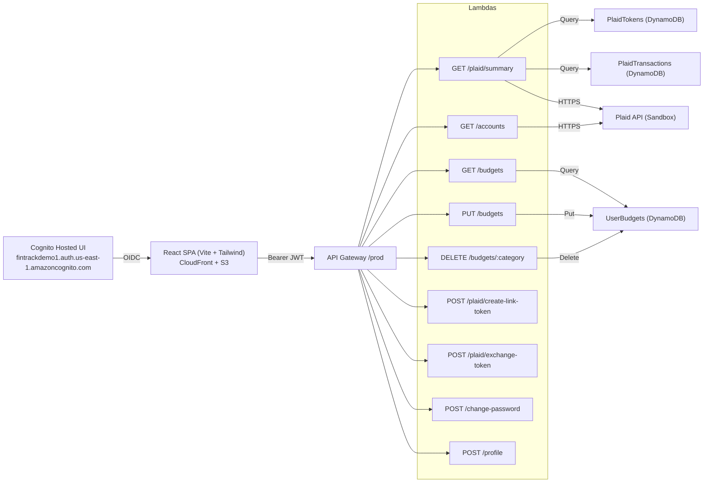

# FinTrack

*A personal finance dashboard with Plaid, AWS Cognito OIDC auth, and a fully serverless backend on AWS.*

> **Live Demo:** `https://d20zeyg4ora1rm.cloudfront.net`
>
> **Demo Login:** `nathan.liviano@gmail.com`  ·  **Password:** `Nathan123`

---

## Overview

FinTrack is a production‑style, **serverless** personal finance app. It authenticates users with **AWS Cognito (OIDC Hosted UI)**, fetches live account balances via **Plaid** (Sandbox), stores user budgets in **DynamoDB**, and exposes a clean REST API through **API Gateway + AWS Lambda**. The front end is a responsive **React (Vite) + Tailwind** single‑page app delivered by **S3/CloudFront**, with CI/CD via **GitHub Actions**.

For users who haven’t linked Plaid, the API automatically serves **demo data** (accounts, transactions, category summaries) and marks responses with the header `x-demo: true`. The UI reads that header to show a demo banner and a **Connect a Bank** button.

---

## Why this project matters

* **Real auth integration** – OIDC flow with Cognito Hosted UI; JWT is attached to every API call and validated by the API Gateway authorizer.
* **Serverless architecture** – API Gateway + Lambda + DynamoDB + CloudFront. Small operational surface, fast deploys, least‑privilege IAM.
* **Plaid integration** – Create Link Token → exchange Public Token → call Plaid `/accounts/balance/get` → sync transactions → aggregate for charts.
* **Resilient UX** – Seamless **demo fallback** when Plaid isn’t linked, so evaluators can explore immediately.
* **Clean data model** – DynamoDB patterns per feature: budgets keyed on `userId/category`; transactions on `userId/transactionId`.
* **CI/CD** – GitHub Actions builds the SPA, deploys to S3, and invalidates CloudFront.
* **Security‑first** – Tight CORS, clear handling for 401/403/429, and signed transaction amounts throughout the stack.

---

## Feature summary

* **Auth**: Cognito Hosted UI; the SPA attaches `Authorization: Bearer <jwt>` to all API calls.
* **Accounts**: Live balances from Plaid; automatic demo balances when no bank is linked.
* **Transactions**: **Synced Plaid transactions** (90‑day window) stored in DynamoDB when linked; **synthetic demo transactions** with the same shape otherwise. Amounts are signed (`debit` negative, `credit` positive). Category totals power charts.
* **Budgets CRUD**: Create / update / delete monthly limits per category in DynamoDB. The UI shows progress bars with traffic‑light thresholds.
* **Dashboard**: Balance card, **Income vs. Expenses** line chart, **Top Categories** donut chart, and a transaction list.
* **Demo mode contract**: APIs return valid data plus `x-demo: true`. The SPA shows a banner and renders a **Connect a Bank** button.

---

## Architecture



**Primary AWS resources**

* **CloudFront** – CDN for the SPA.
* **S3** – Static hosting bucket for the SPA build.
* **API Gateway (REST)** – `/prod` stage exposing all routes.
* **Lambda** – One function per endpoint.
* **DynamoDB** –

  * `PlaidTokens` — `PK: userId (S)`; stores Plaid `access_token`.
  * `PlaidTransactions` — `PK: userId (S)`, `SK: transactionId (S)`; 90‑day history when linked.
  * `UserBudgets` — `PK: userId (S)`, `SK: category (S)`; `monthlyLimit (N)`.
* **Cognito User Pool** – OIDC Hosted UI and JWT issuance.

---

## Endpoints

All endpoints expect a valid **JWT access token** in `Authorization: Bearer <token>`.

### Plaid

* `POST /plaid/create-link-token` → `{ link_token }`

* `POST /plaid/exchange-token` → exchanges `public_token` for Plaid `access_token` and persists it in `PlaidTokens`.

* `GET /plaid/summary` → returns a dashboard payload:

  ```json
  {
    "balance": 723.00,
    "balanceDate": "7/25/2025",
    "chartData": [{ "name": "05", "income": 2500, "expenses": 350 }],
    "categoryData": [{ "name": "Groceries", "value": 210.34 }],
    "transactions": [{ "date": "2025-07-01", "amount": -82.34, "type": "debit", "category": "Groceries" }]
  }
  ```

  **Demo mode:** if no Plaid token or a Plaid call fails, the Lambda returns a synthetic payload **and** header `x-demo: true`.

* `GET /accounts` → array of `{ accountId, institution, name, mask, type, current, available }`.
  **Demo mode:** same `x-demo: true` header.

### Budgets

* `GET /budgets` → `[{ category, monthlyLimit }]`
* `PUT /budgets` → upsert `{ category, monthlyLimit }` (number). Returns `204`.
* `DELETE /budgets/{category}` → returns `204`.

### User profile / security

* `POST /profile` → update display name (optimistic UI on client).
* `POST /change-password` → Cognito `ChangePassword` using the access token.

> **CORS:** All responses include `Access-Control-Allow-Origin: *` and `Access-Control-Allow-Headers: Content-Type,Authorization`. `/plaid/summary` and `/accounts` also expose `x-demo` via `Access-Control-Expose-Headers: x-demo`.

---

## Front end

* **React (Vite)** SPA with **Tailwind CSS**.
* **Auth**: `react-oidc-context` handles the OIDC session with Cognito Hosted UI.
* **State**: lightweight custom hooks; `useDashboardData` reads `x-demo` to toggle demo messaging and the **Connect a Bank** button.
* **UI polish**: progress bars for budgets; charts for income vs. expenses and top categories.

---

## Backend configuration

Environment variables used by Lambdas:

* `PLAID_CLIENT_ID`
* `PLAID_SECRET`
* `PLAID_ENV` (e.g., `sandbox`)
* `PLAID_TOKENS_TABLE` = `PlaidTokens`
* `PLAID_TX_TABLE` = `PlaidTransactions`
* `BUDGETS_TABLE` = `UserBudgets`

---

## CI/CD

* **GitHub Actions** builds the SPA, uploads to S3, and invalidates CloudFront.

---

## Roadmap

Chronological path of how the project was built, plus the next polish step.

### ✅ Phase 0 — Git & CI foundation

* Initialize repo and PR checks.
* CI configured; first full deploy executed late in the build once features stabilized.

### ✅ Phase 1 — Front‑end scaffold & hosting

* React (Vite) + Tailwind; layout and core components.
* S3/CloudFront hosting.

### ✅ Phase 2 — Cognito (OIDC Hosted UI)

* Hosted UI, app client, and token handling in the SPA.

### ✅ Phase 3 — Lambda bootstrapping

* Lambda handlers per route, shared response/CORS helpers, least‑privilege IAM.

### ✅ Phase 4 — API Gateway

* REST `/prod` stage with JWT authorizer and CORS.

### ✅ Phase 5 — Plaid integration

* Link token flow; token exchange; balances; transaction sync (90 days).

### ✅ Phase 6 — Budgets CRUD (DynamoDB)

* GET/PUT/DELETE with progress UI and color thresholds.

### ✅ Phase 7 — Demo mode fallback

* Inline demo dataset; `x-demo: true` contract; SPA banner + link button.

---

### 🔜 Phase 8 — UX polish

* Toasts for CRUD/link/profile/password.
* Skeleton loaders for Dashboard, Budgets, Accounts.
* Accessibility pass (focus, keyboard nav, contrast).

---

## License

MIT — © Nathan Liriano
